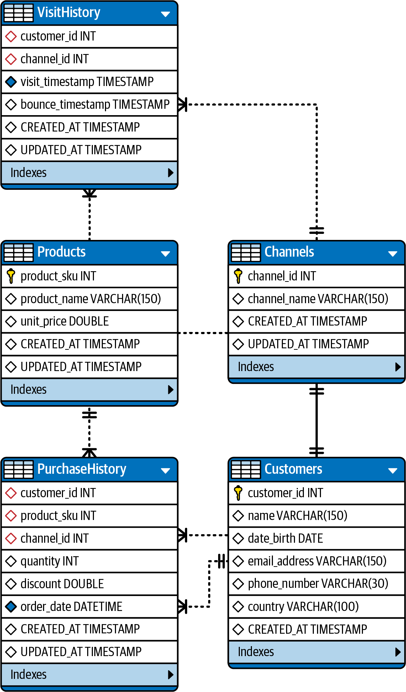

# analytics engineering case with dbt

## Definição do problema de negócio e contexto

A empresa XPTO visa melhorar a experiência de seus clientes, fornecendo interações contínuas e personalizadas. Para isso, necessita de um modelo de banco de dados abrangente e confiável, que possa ser usado para análise de dados e geração de relatórios.

Para nos ajudar neste desafio, a empresa XPTO nos forneceu um conjunto de dados de vendas de produtos de uma loja online. O conjunto de dados contém informações sobre pedidos, produtos e clientes.

Segue abaixo um ERD do modelo de dados proposto:

## Arquitetura de dados utilizada

Supondo que estes dados se encontram em banco de dados Mysql, nos foi solicitado que criássemos uma pipeline de dados com Python e dbt para carregar os dados de vendas de produtos de uma loja online para um data warehouse na nuvem (Bigquery).

Para isso, utilizamos o seguinte fluxo de dados:

 1. Desenvolvimento de um script em Python para extrair os dados do banco de dados Mysql
 2. Limpar alguns tipos de dados
 3. Enviar para o projeto no BigQuery

Assim que os dados estiverem no BigQuery, utilizamos o dbt para criar um modelo de dados que atenda as necessidades de negócio da empresa XPTO.

